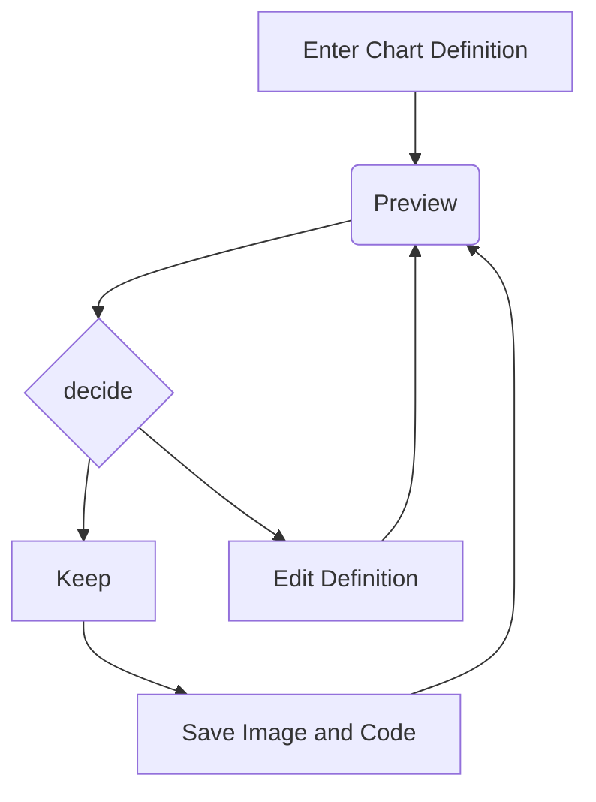

# Task-ify C# Code
## David Aramant

---



---

## 😎

```csharp
public async Task DoStuffAsync()
{
    await Dog.WoofAsync();
    await Cat.FeedAsync();
}
```

---

## 🥵

```csharp
interface INativeApi
{
    void DoAsyncThing(int input, Action<int> callback);
}
```

---

```csharp
public Task<int> DoStuffAsync(int input)
{
    var tcs = new TaskCompletionSource<int>();

    _nativeApi.DoAsyncThing(
        input, 
        callback: i => tcs.SetResult(i));

    return tcs.Task;
}
```

---

What about collections?

---

JEDI example with Hangfire

Diagram: IEnumerable<T> stuff input
Output from native: just a method call
Output from class: ?

---

Is this the correct return type?

```csharp
Task<IEnumerable<T>>
```

---

For batches, return a collection

```csharp
Task<IReadOnlyCollection<T>>
```

---

What about this?

```csharp
IEnumerable<Task<T>>
```

---

.NET is way ahead of you

```csharp
IAsyncEnumerable<T>
```

---

```csharp
IAsyncEnumerable<T> stuff = ...

await foreach(var a in stuff)
{
    ...
}
```

---

Also check out `System.Linq.Async`

```csharp
SingleAsync()
FirstAsync()
ToListAsync()
```

---

Now how do we turn "function call" into `IAsyncEnumerable<T>`?

Diagram: updated with correct return type

---

```csharp
System.Threading.Channels
```

---

Example with channel

---

Updated diagram