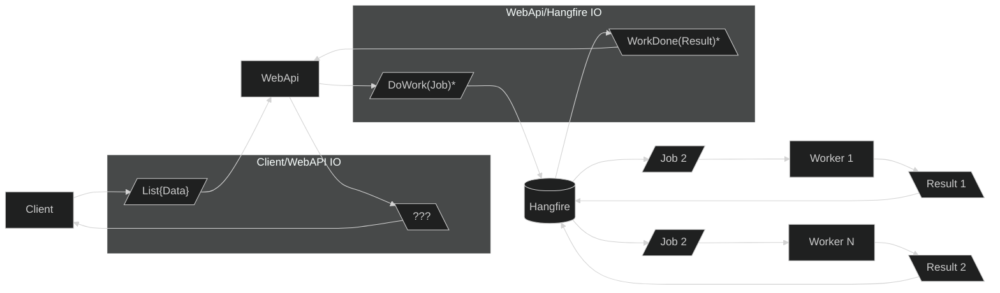

# Task-ify C# Code
## David Aramant

---

## 😎

```csharp
public async Task DoStuffAsync()
{
    await Dog.WoofAsync();
    await Cat.FeedAsync();
}
```

---

## 🥵

```csharp
interface INativeApi
{
    void DoAsyncThing(int input, Action<int> callback);
}
```

---

```csharp
public Task<int> DoStuffAsync(int input)
{
    var tcs = new TaskCompletionSource<int>();

    _nativeApi.DoAsyncThing(
        input, 
        callback: i => tcs.SetResult(i));

    return tcs.Task;
}
```

---

# What about collections?

---

## JEDI Interaction with Design Workers


---

# Is this the correct return type?

# `Task<IEnumerable<T>>`
---

# For _batches_, return a collection

# `Task<IReadOnlyCollection<T>>`

---

# What about this?

# `IEnumerable<Task<T>>`

---

# .NET is way ahead of you

# ~~`IEnumerable<Task<T>>`~~
# `IAsyncEnumerable<T>`

---

```csharp
IAsyncEnumerable<T> stuff = ...

await foreach(var a in stuff)
{
    ...
}
```

---

# Also check out `System.Linq.Async`

```csharp
SingleAsync()
FirstAsync()
ToListAsync()
```

---

# Now how do we turn "function call" into `IAsyncEnumerable<T>`?

Diagram: updated with correct return type

---

# `System.Threading.Channels`

---

Example with channel

---

Updated diagram